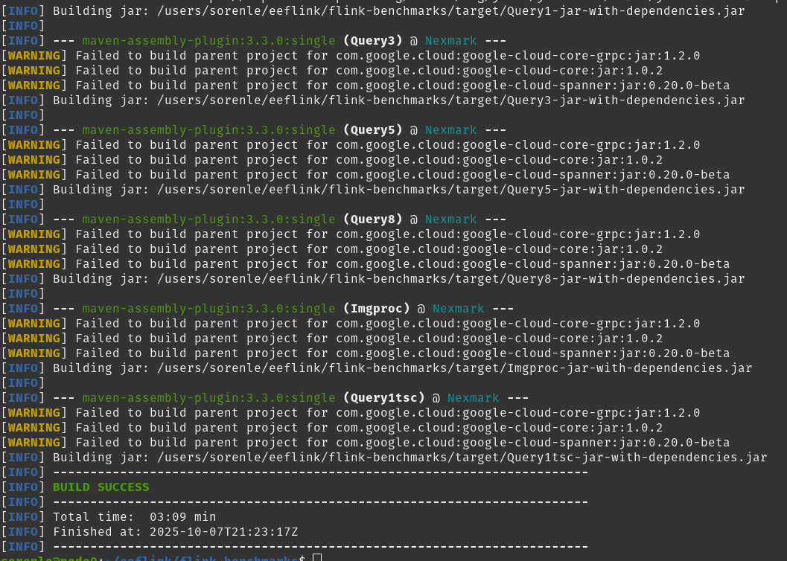
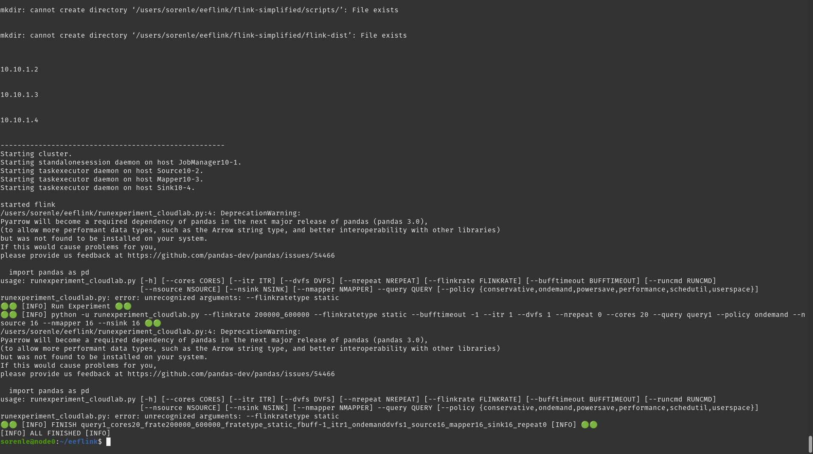

Ran into an error when trying to run this:

```cd ~/eeflink
git clone git@github.com:EEStrmCmptng/flink-benchmarks.git
cd flink-benchmarks
mvn clean package
```

from the README
Here's the error:


Ran into another error when running this code on the Job Manager Node:

```
cd ~/eeflink
MCFG="16;16;16" MQUERY="query1" FLINK_RATE="200000_600000" MPOLICY="ondemand" ./run_query1.sh dynamic
```

Here's the error:

